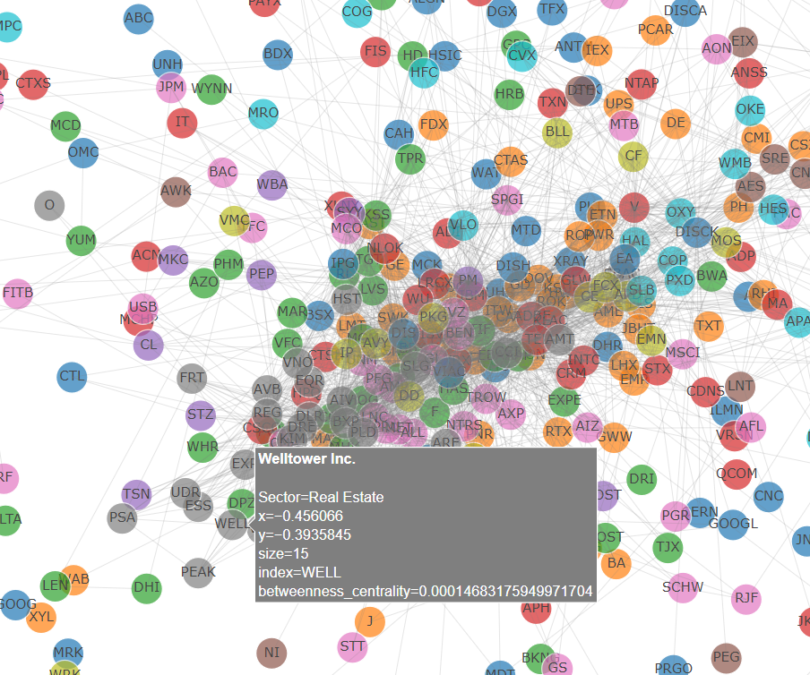

# Stock Correlation Network Topology Analysis

## Introduction

A tool to perform a network analysis of different stocks and visualize their mesh topology. This project revolved around the intuition that a network map of different stocks could reveal previously unanticipated market movements of groups of stocks defined outside of conventionally used classifications such as sectors and industries. A live demo can be found at [https://stock-network-analysis.herokuapp.com](https://stock-network-analysis.herokuapp.com/)

## Literature Review

There have been several past studies that perform network analysis on stocks as case studies or one-time experiment showing network graphs of certain stocks over a definite time period, however, most of these studies have not created an easily reproducible and explorable framework or tool to be able to tune and instantly observe the effect of various factors and variables such as the time period, correlation threshold, or the metrics displayed by different factors of the graph.

## Problem

The problem was scoped down to creating an interactive and responsive platform to observe different patterns and trends in a stock network graph, while easily being able to tune different variables and being accessible without performing tedious manual work such as the collection, preprocessing, and filtering of data.

## Methodologies

#### 1. Loading Data

Before proceeding to create the tools to perform analysis, We had to choose stocks and gather their time-series data. To do this, among many other services, We came across the Alpha Vantage API which was the most easily accessible service that did not require an institution or any costs to access.

It was decided that the stocks present in the S&P 500 index would be the sample used in this project, and a python script was used to write all the time-series data for each stock to different files.

#### 2. Preprocessing

After having performed analysis on the data without preprocessing the data, and getting an absurd amount of connections, We realized the effect the lack of preprocessing had on the results.

The first step in preprocessing the data was to detrend it, since all stocks would doubtlessly show a high correlation over time since the market moves upward in general. Two methods were tried, the use of percent change and link relatives. When compared, there was a negligible difference, and percent change was the selected method of detrending.

A rolling mean with a variable window size as defined by the user was then employed to dampen the fluctuations in day to day changes.

#### 3. Defining the Graph

The actual graph nodes were defined by each stock obtained in the sample used by the tool, with node color and size defined by the factors chosen by the user as one of degree centrality, betweenness centrality, closeness centrality, and the gain or loss percentage. The nodes were labeled by their ticker and users have the option of color marking nodes by their sector.

The time series pertaining to the closing price of each stock in the sample was defined as a column in a single matrix. The correlation matrix of this data was then calculated based on the Pearson Product Moment Correlation.

Edges were defined between any two nodes that had a correlation coefficient greater than the user-defined edge definition threshold.

These nodes and edges were then fed into a network graph analysis python module called NetworkX, which was used to perform a Fruchterman Reingold drawing simulation that can visualize communities, influence, and the general importance of some nodes over others. The number of iterations and the node distance of the simulation is defined by the user of the tool.

Clicking on a node shows a table with a list of nodes it is connected to.

## Results

To test the tool, one of the first time frames we loaded was the period of the financial crisis. The nodes tended to form clusters with other nodes belonging to the same sector as it would be presumed. Another observation was the higher values of centrality and the higher mesh density of the real estate and financial sectors, which is reasonable because of their weight of impact on the market during the time. Additionally, looking at various other time frames, real estate and utilities appeared to form common clusters at the same location, which could be justified by a general postulation on how an increase in houses might for example lead to an increase in demand for basic amenities such as water supply and electricity, commonly associated with buying a house.

_#1 Snapshot of the graph during the financial crisis depicting real estate shown in grey color and financials shown in pink_

## Conclusion

After testing a few different time periods and tuning different variables and confirming that my tool works, we identified a few areas that this tool is lacking in.

One of the first aspects of the tool that becomes apparent is the general slowness and sluggishness of the tool. Preprocessing and calculating factors in real-time use requires the tool to perform enormous amounts of calculations quickly. Some ways to optimize this could be to write code that is able to utilize GPUs and caching results of common time-windows.

Another factor, which, however, does not necessarily pertain to the tool, is the method of sampling stocks. Past studies have chosen stocks from indices such as the Dow Jones, S&P 500, or have used criteria similar to that corresponding to the top 100 stocks by market capitalization. This, however, might not necessarily give the best results, because large companies tend to have an overall impact on the market, which is outside of the direct and specific relationships we are targeting. To fix this, a method to filter out or dampen the impact of such stocks by targeting large-cap stocks and increasing the threshold needed to define edges for such stocks might work.

## Future Extensions

I continue to expand on this project, with some avenues being optimizing performance, creating methods to better sample stocks for test cases, the inclusion of other attributes such as change in volume, market capitalization, earnings, and using windowed time-lagged correlation analysis.

This type of analysis can be expanded to other scenarios such as supply chain management, mapping of drugs to effects on cells, tracking money/crypto laundering, etc.

## Similar Works and References

[1] David Dindi, Alp Ozturk, and Keith Wyngarden. Predicting Stock Movements Using Market Correlation Networks

[2] Graph Theory (2010). _MIT OpenCourseWare_

[3] John Peter & Timo Perttunen (2014). NETWORK TOPOLOGIES. Sterlite Tech

[4] Kinshu Gupta (2020). _Stock Network Graph_

[5] Maxime Rivet, Marc Thibault, and Mael Trean. Cross-Section Performance Reversion
